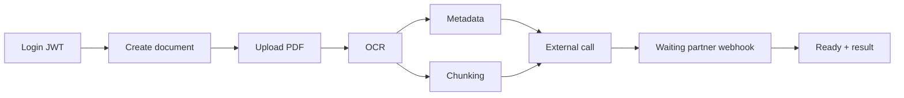
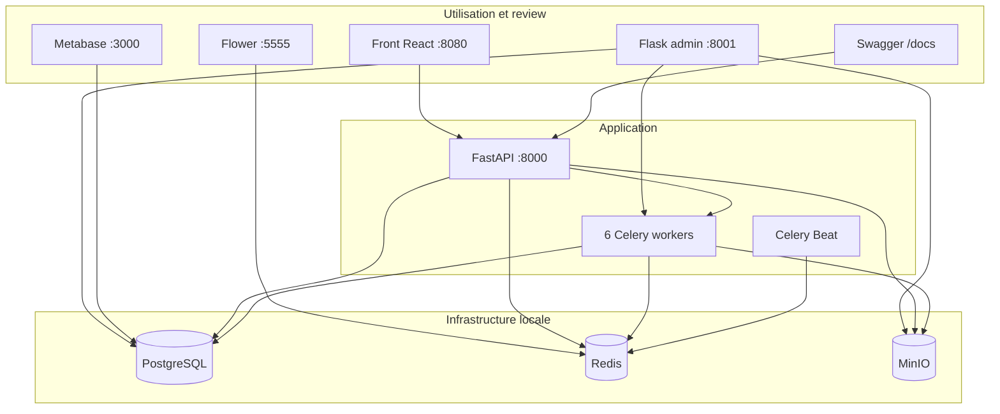

# Primmo backend technical test

- Date : 2026-06-19
- Sujet de reference : [`docs/Technical_Test.md`](docs/Technical_Test.md)
- Document de conception principal : [`docs/Technical_Strategy.md`](docs/Technical_Strategy.md)
- Developpeur : Alexandre ENOUF
- Mail : alexandre.enouf@gmail.com

Ce README est le guide de lecture du rendu. Il explique ce qui a ete construit,
pourquoi l'architecture ressemble a un systeme de production, comment lancer la
stack locale, et comment utiliser les outils livres : front, admin, Metabase,
Flower et Swagger.

Pour le detail technique complet, les arbitrages et les limites, lire ensuite
[`docs/Technical_Strategy.md`](docs/Technical_Strategy.md). C'est le document de
reference qui a guide la construction de l'application.

## Methode de developpement

Le projet a ete developpe avec une assistance IA assumee. J'ai utilise Codex
`GPT-5.5 xhigh fast` avec les skills Superpowers pour cadrer, implementer,
relire et simplifier le rendu. Pour le front, je suis parti de Claude Design,
puis du skill Claude Frontend Design pour transformer la maquette en interface
React utilisable. Claude a aussi ete utilise pour ameliorer le Flask admin et
rendre le cockpit local plus lisible.

## Note personnelle

J'ai pris plaisir a faire ce test et je continuerai probablement ce projet de
mon cote. Il ressemble a des sujets backend que je traite au travail :
pipelines asynchrones, partenaires externes, retries, observabilite et outils
internes. C'est aussi un bon terrain pour tester des hypotheses que j'ai en tete
depuis quelque temps mais qui ne sont pas toujours prioritaires au quotidien,
comme une vraie base analytique type ClickHouse pour stocker les evenements et
construire des dashboards historiques.

## 1. Ce qui est build

Le projet implemente une plateforme locale d'ingestion de documents PDF
multi-tenant.

Un utilisateur se connecte, cree un document, depose son PDF, lance un pipeline
asynchrone, suit l'avancement, puis consulte les resultats quand le webhook
partenaire a confirme la fin du traitement.

Le flux fonctionnel est :



Le rendu ne se limite pas a une API. Il livre aussi les surfaces qui permettent
de comprendre, tester et operer le systeme :

| Surface | Role |
| --- | --- |
| Front React | Parcours utilisateur : login, upload, suivi, resultats |
| Swagger FastAPI | Contrat API et test manuel des endpoints |
| Flask admin | Cockpit local pour reviewer, inspecter, relancer et simuler le partenaire |
| Metabase | Dashboards de lecture metier sur PostgreSQL |
| Flower | Observation runtime Celery : workers, queues, tasks, retries |
| MinIO console | Inspection du stockage objet local |

## 2. Pourquoi cette architecture

J'ai choisi une architecture proche de celle que j'utilise dans mon travail
actuel sur des pipelines ETL a fort volume : environ `200 000 pipelines ETL/jour`.

Les traitements metier ne sont pas les memes : ici il y a OCR, metadata,
chunking et appel partenaire ; dans mon contexte professionnel, les services
externes ont leurs propres complexites, contrats, latences, erreurs et
specificites. Mais le modele operationnel est tres proche :

- une API qui reste rapide et stateless ;
- une base relationnelle comme source de verite ;
- des workers pour les traitements longs, retryables ou instables ;
- un stockage objet pour les fichiers ;
- des outils separes pour utiliser, administrer et observer ;
- une trajectoire claire vers le scale sans reecrire le coeur.

Le sujet demande aujourd'hui environ `1 000 documents/jour` et `50 utilisateurs
concurrents`, avec une discussion de montee en charge jusqu'a `100 000
documents/jour`. Le choix n'est donc pas de sur-engineerer le test. Le choix est
de montrer un modele deja credible : simple a lancer localement, mais structure
comme une vraie plateforme.

## 3. Architecture globale



Lecture simple :

- **FastAPI** porte l'API publique, l'auth JWT, les documents, le suivi SSE et le
  webhook partenaire.
- **PostgreSQL** garde l'etat durable : organisations, users, documents, steps
  et resultats.
- **MinIO** simule S3 pour stocker les PDFs hors base.
- **Celery** execute les traitements longs et gere les retries.
- **Redis** sert de broker Celery et de bus Pub/Sub pour les evenements de
  progression.
- **Flask admin**, **Metabase** et **Flower** ne remplacent pas l'API : ce sont
  des outils de review, d'exploitation et d'observation.

## 4. Organisation du code

Le code est organise par domaines fonctionnels pour permettre une lecture par
cas d'usage.

```text
app/
  main.py                    # assemblage FastAPI
  celery_app.py              # configuration Celery
  core/                      # configuration applicative
  db/                        # SQLAlchemy, migrations, seed
  domain/                    # enums et modeles domaine
  modules/
    auth/                    # login, JWT, user courant
    documents/               # creation, upload, liste, detail, resultats, SSE
    processing/              # pipeline, tasks, retries, progress, recovery
    partner_webhooks/        # webhook signe HMAC
    dev/                     # helpers locaux Swagger
    admin/                   # Flask admin local
front/                       # front React de demonstration
scripts/bootstrap_metabase.py
docker-compose.yml
Makefile
docs/
```

Les routes restent fines. Elles valident l'HTTP, recuperent le user courant,
puis appellent des services ou repositories. Les tasks Celery sont proches des
fonctions metier qu'elles executent, ce qui rend le pipeline facile a suivre.

## 5. Chiffres cles

| Sujet | Valeur |
| --- | --- |
| Experience d'architecture utilisee comme reference | ~`200 000 pipelines ETL/jour` |
| Cible du sujet aujourd'hui | ~`1 000 documents/jour`, ~`50 utilisateurs concurrents` |
| Cible de discussion scale du sujet | jusqu'a `100 000 documents/jour` |
| Services Docker lances | `15` |
| Workers Celery dedies | `6` queues : pipeline, OCR, metadata, chunking, external call, recovery |
| Routes HTTP FastAPI/Flask | `24` |
| Fichiers de tests | `32` |
| Tenants seed | `2` organisations, `2` users |
| Taille max upload local | `20 MB` |
| Expiration URL upload | `300 s` |

Ces chiffres ne constituent pas un benchmark de production. Ils donnent le
contexte de conception et les points de controle du rendu.

## 6. Lancer le projet

Depuis un environnement propre :

```bash
make clean
make bootstrap
```

Si les volumes Docker locaux sont deja dans un etat sain :

```bash
make bootstrap
```

`make bootstrap` lance Docker Compose, applique les migrations, seed les deux
organisations de demo, configure Metabase, puis affiche les liens locaux.

Commandes utiles :

```bash
make links              # afficher les URLs locales
make ps                 # voir les services
make logs SERVICE=api   # suivre les logs d'un service
make down               # arreter la stack
make clean              # arreter et supprimer les volumes locaux
```

Comptes de demo applicatifs :

| Organisation | Email | Mot de passe |
| --- | --- | --- |
| Primmo Alpha | `alpha@example.com` | `primmo-demo` |
| Primmo Beta | `beta@example.com` | `primmo-demo` |

URLs locales :

| Outil | URL | Identifiants |
| --- | --- | --- |
| Front demo | <http://127.0.0.1:8080> | comptes Alpha/Beta ci-dessus |
| API | <http://127.0.0.1:8000> | JWT via `/auth/login` |
| Swagger | <http://127.0.0.1:8000/docs> | JWT via `Authorize` |
| Flask admin | <http://127.0.0.1:8001> | local only |
| Test cockpit admin | <http://127.0.0.1:8001/test-cockpit> | local only |
| Metabase | <http://127.0.0.1:3000> | `admin@primmo.local` / `PrimmoAdmin2026!` |
| Flower | <http://127.0.0.1:5555> | local only |
| MinIO console | <http://127.0.0.1:9001> | `minioadmin` / `minioadmin` |

## 7. Comment s'en servir

### Parcours utilisateur avec le front

Ouvrir <http://127.0.0.1:8080>.

Le front est la surface la plus simple pour comprendre le produit :

1. choisir le compte Alpha ou Beta ;
2. se connecter avec `primmo-demo` ;
3. creer un document ;
4. selectionner un PDF ;
5. lancer l'upload et le pipeline ;
6. suivre les statuts et les steps en direct ;
7. consulter le resultat quand le document passe `ready`.

Le front montre aussi le comportement multi-tenant : les documents Alpha et Beta
restent separes. Un utilisateur ne choisit jamais son `org_id` dans les routes
publiques ; il vient du JWT.

Pour faciliter la demo locale depuis le navigateur, le front utilise le helper
local `/dev/documents/{document_id}/upload`. Le flux produit reste documente
dans l'API : creation du document, URL PUT pre-signee, upload objet, puis
`complete-upload`.

### Parcours reviewer avec Swagger

Ouvrir <http://127.0.0.1:8000/docs>.

Swagger sert a verifier le contrat API :

1. `POST /auth/login` avec `alpha@example.com` / `primmo-demo`.
2. Copier le JWT dans `Authorize` avec `Bearer <token>`.
3. `POST /documents` pour declarer un PDF.
4. `POST /dev/documents/{document_id}/upload` pour deposer un PDF depuis
   Swagger en local.
5. `POST /documents/{document_id}/complete-upload` pour lancer le pipeline.
6. `GET /documents/{document_id}` ou `GET /documents/{document_id}/events` pour
   suivre la progression.
7. Quand le document passe `waiting_partner`, utiliser `external_job_id`.
8. `POST /dev/partner-signature` pour signer un body webhook de test.
9. `POST /webhooks/partner` avec `X-Partner-Signature`.
10. `GET /documents/{document_id}/result` quand le document est `ready`.

### Parcours operateur avec Flask admin

Ouvrir <http://127.0.0.1:8001/test-cockpit>.

Le Flask admin est volontairement separe de l'API publique. Il sert a inspecter
et agir localement sans transformer les routes publiques en back-office.

Les usages principaux :

- creer rapidement des faux PDFs pour un user seed ;
- regarder les documents avancer dans le pipeline ;
- ouvrir le detail d'un document et ses processing steps ;
- simuler un webhook partenaire `completed` ou `rejected` ;
- relancer un pipeline complet ou une strategie ciblee ;
- creer des lots de documents depuis `/documents/new` ;
- filtrer organisations, users, documents et steps.

Le cockpit a ete pense comme le chemin le plus court pour un reviewer : creer
des documents, attendre `waiting_partner`, simuler le partenaire, verifier
`ready`.

### Parcours PM ou data ops avec Metabase

Ouvrir <http://127.0.0.1:3000>.

Metabase est configure par `make bootstrap`. Il lit PostgreSQL pour donner une
vue metier du snapshot courant :

- repartition des documents par statut ;
- documents actifs par step courante ;
- documents en erreur ;
- documents en attente du webhook partenaire ;
- usage par organisation et par utilisateur ;
- controles simples de coherence des donnees.

Point important : le modele actuel garde l'etat courant des steps, pas tout
l'historique d'execution. Metabase sert donc au triage et a la lecture du
present. Les tendances historiques, p95 et analyses temporelles demanderaient
une future table append-only d'evenements ou de runs.

### Parcours backend avec Flower

Ouvrir <http://127.0.0.1:5555>.

Flower permet de voir le runtime Celery :

- workers actifs ;
- queues separees ;
- tasks en cours ;
- retries ;
- erreurs ;
- charge par workload.

La stack locale lance un worker dedie par queue. Cela rend lisible le
comportement du pipeline : OCR, metadata, chunking, external call et recovery ne
sont pas melanges dans un worker unique.

### Inspection stockage avec MinIO

Ouvrir <http://127.0.0.1:9001>.

MinIO permet de verifier que les PDFs sont stockes hors PostgreSQL, avec une
cle lisible contenant organisation, user, document et filename. En production,
le meme pattern irait vers S3 ou un stockage objet equivalent.

## 8. Parcours de review recommande

Pour evaluer rapidement le rendu sans se perdre :

1. Lancer `make bootstrap`.
2. Ouvrir le front et faire un upload avec Alpha.
3. Ouvrir Flower pour voir les workers traiter les tasks.
4. Ouvrir le Flask admin `/test-cockpit` pour inspecter le document.
5. Quand le document attend le partenaire, simuler le webhook depuis l'admin.
6. Verifier le passage en `ready` dans le front.
7. Ouvrir Metabase pour voir les dashboards se mettre a jour.
8. Lire [`docs/Technical_Strategy.md`](docs/Technical_Strategy.md) pour les
   choix techniques detailles.

Ce parcours montre les points forts sans lire tout le code : multi-tenant,
pipeline asynchrone, workers separes, progression, webhook signe, outils
d'exploitation et observabilite.

## 9. Points forts du rendu

- **Parcours bout-en-bout testable** : login, upload, pipeline, webhook,
  resultat.
- **Architecture prod-like** : API stateless, workers, DB source de verite,
  stockage objet, observabilite.
- **Multi-tenant propre** : l'API filtre par `org_id` du user courant, pas par
  un parametre client.
- **Pipeline asynchrone** : Celery canvas avec OCR, metadata/chunking en
  parallele, external call puis attente webhook.
- **Retries lisibles** : les steps passent par `running`, `retrying`, `success`
  ou `failed`.
- **Progression temps reel** : SSE cote API, Redis Pub/Sub entre workers et API,
  snapshot PostgreSQL au demarrage.
- **Webhook partenaire securise** : HMAC-SHA256 verifie sur le body brut.
- **Outils d'exploitation** : front, admin, Metabase, Flower et MinIO.
- **Tests proches du code** : tests unitaires et integration par module.
- **Limites explicites** : ce qui manque pour une vraie production est documente,
  pas cache.

## 10. Tests et verification

Commandes principales :

```bash
make test
make test-unit
make test-integration
make coverage
```

La couverture de tests vise les zones qui portent le plus de risque :

- auth JWT ;
- isolation multi-tenant ;
- routes documents ;
- stockage MinIO ;
- pipeline et strategies ;
- retries Celery ;
- progression ;
- webhook HMAC ;
- seed et DB ;
- admin local ;
- coherence Docker Compose et Metabase bootstrap.

## 11. Lire la suite

Le README donne la vue d'ensemble et le mode d'emploi. Les details sont separes
pour garder une lecture fluide.

| Document | Role |
| --- | --- |
| [`docs/Technical_Strategy.md`](docs/Technical_Strategy.md) | Document de reference : choix d'architecture, modele de donnees, statuts, retries, scale, limites |
| [`docs/Technical_Test.md`](docs/Technical_Test.md) | Sujet original |
| [`docs/Public_API_Pagination.md`](docs/Public_API_Pagination.md) | Pagination curseur et contrat `GET /documents` |
| [`docs/Recovery_Jobs.md`](docs/Recovery_Jobs.md) | Recovery des documents uploades mais non enqueues |
| [`docs/Flask_Admin.md`](docs/Flask_Admin.md) | Detail du back-office local |
| [`docs/Observability_Stats.md`](docs/Observability_Stats.md) | Metabase, dashboards et limites du snapshot |
| [`docs/Async_Adoption.md`](docs/Async_Adoption.md) | Pourquoi ne pas tout migrer en `async def` |
| [`docs/Async_Workers_Scaling.md`](docs/Async_Workers_Scaling.md) | Scaling futur Celery, gevent, quotas et DB |

## 12. Limites assumees

Le rendu est un test technique local, pas un deploiement production. Les limites
principales sont assumees :

- OCR, metadata, chunking et partenaire sont des fonctions mockees ;
- pas de benchmark reel a `100 000 documents/jour` ;
- pas d'outbox transactionnelle ;
- pas d'historique append-only complet des executions ;
- pas de replay durable des events SSE ;
- pas de read replica local ;
- pas de rate limiting par organisation ou provider ;
- Flask admin local sans auth forte ni CSRF ;
- secrets locaux par defaut pour faciliter la demo ;
- pas de CI/CD ni de deploiement production.

La trajectoire de production est detaillee dans
[`docs/Technical_Strategy.md`](docs/Technical_Strategy.md), avec les evolutions
prioritaires : outbox, historique de runs, audit admin, quotas, circuit breakers,
metriques, traces, read replicas et evaluation RabbitMQ.
