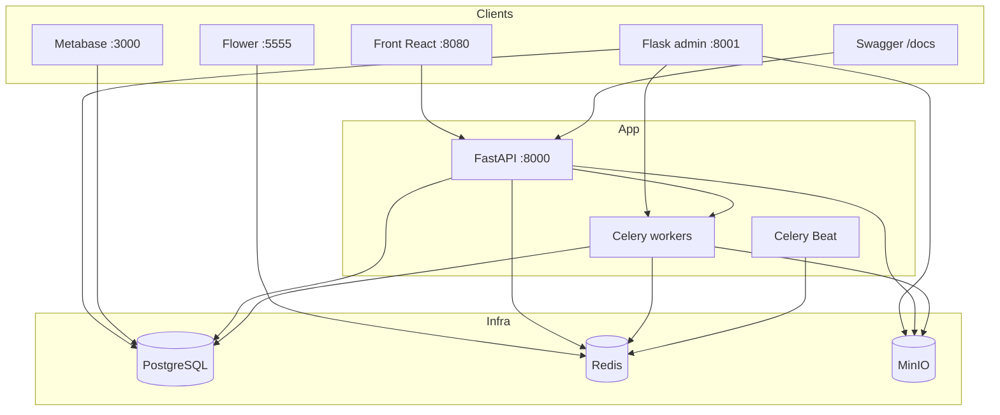
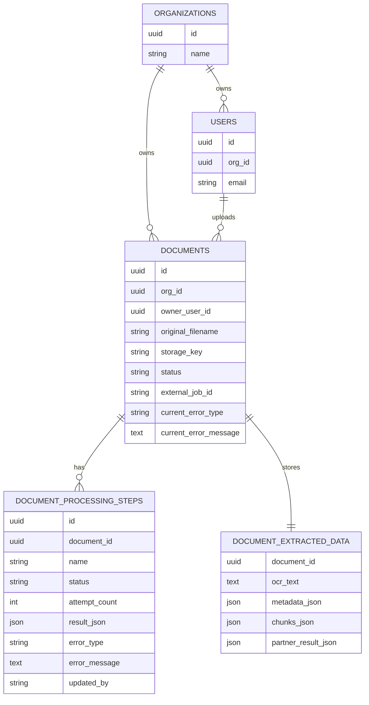
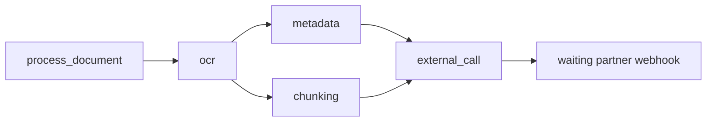

# Strategie technique Primmo

Date : 2026-06-19
Perimetre : test technique backend Senior
Source fonctionnelle : [`docs/Technical_Test.md`](Technical_Test.md)
Etat : document aligne avec le code actuel

Ce document explique les choix techniques qui ont guide l'application.

Pour lancer et utiliser le rendu, lire d'abord le [`README.md`](../README.md).
Le README est le guide de review. Cette strategie est le document de reference
sur le "pourquoi".

## 1. Idee directrice

Le projet implemente une plateforme locale d'ingestion de PDF multi-tenant.

Le choix central est simple :

- FastAPI recoit les demandes et reste rapide ;
- PostgreSQL garde l'etat metier durable ;
- Celery execute les traitements lents hors requete HTTP ;
- Redis transporte les jobs Celery et les evenements de progression ;
- MinIO stocke les PDFs hors base ;
- les outils internes lisent ou pilotent le systeme sans polluer l'API publique.

Le point fort du modele est le suivant :

> Pour un document, on garde un seul etat courant du pipeline : le dernier etat
> connu de chaque step. Lire un document ne depend pas du nombre de retries, de
> rejeux ou d'executions passees.

Concretement, la lecture d'un document lit :

1. une ligne `documents` ;
2. une ligne `document_extracted_data` ;
3. un petit groupe fixe de lignes `document_processing_steps`.

Le cout reste donc borne par document. Il est `O(1)` par rapport au nombre
d'essais, de relances et d'historiques passes.

Une table d'historique append-only serait utile plus tard pour l'audit, les p95
et les statistiques. Mais elle ne doit pas remplacer ce modele de lecture
courant. La lecture courante doit rester simple.

## 2. Pourquoi cette architecture

J'ai choisi une architecture proche de celle que j'utilise dans mon travail
actuel sur des pipelines ETL a fort volume : environ `200 000 pipelines ETL/jour`.

Les services metier sont differents. Ici il y a OCR, metadata, chunking et appel
partenaire. Dans mon contexte professionnel, les partenaires externes ont
d'autres contrats, latences, erreurs et specificites.

Le modele operationnel reste le meme :

- une API stateless ;
- des workers pour les traitements longs ;
- une base relationnelle comme source de verite ;
- des retries lisibles ;
- des outils d'exploitation separes ;
- une trajectoire de scale sans reecrire le coeur.

Le sujet vise aujourd'hui environ `1 000 documents/jour` et `50 utilisateurs
concurrents`, avec une discussion jusqu'a `100 000 documents/jour`. L'objectif
n'est pas de benchmarker ce volume en local, mais de montrer un design qui ne
s'effondre pas quand le volume augmente.

## 3. Architecture globale



Responsabilites :

| Brique | Role |
| --- | --- |
| FastAPI | API publique, auth JWT, documents, SSE, webhook partenaire |
| PostgreSQL | source de verite durable |
| MinIO | stockage objet local compatible S3 |
| Celery | traitements longs, retries, orchestration |
| Redis | broker Celery et Pub/Sub progression |
| Front React | parcours utilisateur |
| Flask admin | inspection et actions locales |
| Metabase | lecture metier du snapshot PostgreSQL |
| Flower | lecture runtime Celery |

## 4. Organisation du code

Le code est organise par domaine fonctionnel.

```text
app/
  main.py                    # assemblage FastAPI
  celery_app.py              # configuration Celery
  core/                      # configuration
  db/                        # SQLAlchemy, migrations, seed
  domain/                    # enums et modeles domaine
  modules/
    auth/                    # login, JWT, user courant
    documents/               # creation, upload, liste, detail, resultats, SSE
    processing/              # pipeline, tasks, retries, progress, recovery
    partner_webhooks/        # webhook HMAC
    dev/                     # helpers locaux Swagger
    admin/                   # Flask admin local
front/                       # front React
scripts/bootstrap_metabase.py
```

Les routes FastAPI restent fines. Elles valident l'HTTP, recuperent le user
courant, puis appellent un service ou repository.

Les repositories isolent SQLAlchemy. Les services portent les transitions
metier. Les tasks Celery restent proches des fonctions qu'elles executent.

## 5. Modele de donnees

Le modele garde l'etat courant du systeme, pas tout l'historique.



### Decision cle : un groupe courant de steps par document

Chaque document a au plus une ligne par step grace a la contrainte unique
`(document_id, name)`.

Exemple :

```text
document A
  ocr              -> dernier statut/resultat
  metadata         -> dernier statut/resultat
  chunking         -> dernier statut/resultat
  external_call    -> dernier statut/resultat
  partner_webhook  -> dernier statut/resultat
```

Si OCR retry 3 fois, on ne cree pas 3 lignes OCR dans la lecture courante. On met a
jour la ligne `ocr` courante : `attempt_count`, `status`, `error_message`,
`result_json`, `updated_at`.

Si l'admin relance une strategie, les sorties dependantes sont reset puis les
memes lignes courantes sont reutilisees.

Ce choix evite trois problemes :

- scanner un historique pour retrouver le dernier etat ;
- faire des jointures ou window functions sur le chemin de lecture courant ;
- faire grossir le cout de lecture d'un document avec le nombre de retries.

La lecture reste donc stable :

```text
GET /documents/{id}
  = document
  + extracted_data
  + steps courantes fixes
```

C'est ce qui permet au front, a l'admin et au SSE de lire vite l'etat courant.

L'historique complet est une evolution future, separee du modele de lecture
courant. Il servirait a l'audit, aux p95, aux tendances et aux comparaisons
entre versions de resultats.

### Pourquoi `org_id` est sur `documents`

Le tenant est un axe de requete central. Stocker `org_id` directement sur
`documents` rend les filtres simples, indexables et faciles a verifier.

Le client ne fournit jamais `org_id` dans les routes publiques. Le tenant vient
du JWT et du user courant.

### Pourquoi une `storage_key` lisible

Les objets MinIO utilisent une cle humaine :

```text
orgs/<org-name>/users/<user-email>/documents/<document_id>/<filename>
```

Cela rend la demo lisible dans MinIO. Le `document_id` garde l'unicite.

## 6. Statuts

Statuts document :

| Statut | Sens |
| --- | --- |
| `waiting_upload` | document cree, fichier pas encore depose |
| `uploaded` | fichier depose, pipeline pret a demarrer |
| `processing` | pipeline interne en cours |
| `waiting_partner` | `external_call` a retourne un job id, webhook attendu |
| `ready` | webhook partenaire valide, resultats disponibles |
| `failed` | erreur definitive |

Statuts step :

| Statut | Sens |
| --- | --- |
| `pending` | step initialisee |
| `running` | step en cours |
| `retrying` | erreur retryable, Celery va relancer |
| `success` | step terminee |
| `waiting_webhook` | attente partenaire |
| `failed` | erreur definitive |
| `skipped` | reserve pour des strategies futures |

Le statut document donne la lecture produit. Les steps donnent le detail
technique.

## 7. Parcours metier

### Authentification et multi-tenant

`POST /auth/login` retourne un JWT. Les routes documents relisent le user courant
et filtrent par son `org_id`.

Si un user Beta demande un document Alpha, l'API repond `404`. On evite de
confirmer l'existence d'une ressource hors tenant.

### Upload

Le flux produit est en deux temps :

1. `POST /documents` cree la fiche document et retourne une URL PUT pre-signee.
2. Le client upload le PDF vers MinIO/S3.
3. `POST /documents/{id}/complete-upload` verifie l'objet et lance le pipeline.

Pour Swagger et le front local, `POST /dev/documents/{id}/upload` evite la
friction du PUT pre-signe. Ce helper est local/test only.

### Pipeline



Le canvas Celery est construit dans
`app/modules/processing/pipeline/strategies.py`.

`partner_webhook` n'est pas une task Celery. C'est une step d'attente en base.
Elle se termine quand `POST /webhooks/partner` recoit une notification valide.

### Relances admin

Le code expose plusieurs strategies internes :

| Strategie | Sens |
| --- | --- |
| `all` | pipeline complet |
| `ocr` | repart de OCR puis relance les dependances aval |
| `post_ocr` | relance metadata + chunking puis external call |
| `metadata` | relance metadata puis external call |
| `chunking` | relance chunking puis external call |
| `external_call` | relance seulement l'appel partenaire |

Ces strategies restent hors API publique. Elles servent au Flask admin local.

## 8. Retries

Les retries sont centralises dans `app/modules/processing/tasking.py`.

| Step | Exception retryable | Max retries |
| --- | --- | --- |
| OCR | `TimeoutError` | 3 |
| Metadata | `ValueError` | 3 |
| Chunking | `ValueError` | 3 |
| External call | `ConnectionError` | 5 |

Quand une erreur retryable arrive :

1. la step passe `retrying` ;
2. `attempt_count` augmente ;
3. un evenement de progression est publie ;
4. Celery relance avec backoff.

Quand les retries sont epuises, la step passe `failed` et le document passe
`failed`.

## 9. Progression

Le test demande une progression percue a l'echelle de la seconde.

Le besoin est descendant : le serveur informe le client. SSE suffit donc mieux
qu'un WebSocket.

Flux :

1. le client ouvre `GET /documents/{id}/events` ;
2. l'API envoie un snapshot PostgreSQL ;
3. un worker change une step ;
4. le worker publie dans Redis Pub/Sub ;
5. le process FastAPI pousse l'event SSE.

Redis Pub/Sub n'est pas durable. C'est acceptable ici parce que PostgreSQL reste
la source de verite. Si un event est manque, le client relit le snapshot courant.

Pour une production stricte, les evenements passeraient par une outbox
transactionnelle.

## 10. Webhook partenaire et resultats

`external_call` retourne un `job_id`. Le document passe `waiting_partner`.

Le partenaire appelle ensuite :

```http
POST /webhooks/partner
X-Partner-Signature: <hex_hmac_sha256_du_body>
Content-Type: application/json
```

La signature HMAC-SHA256 est verifiee sur le body brut exact, avant parsing JSON.
Reformater le JSON change donc la signature.

Cas principaux :

| Cas | Reponse |
| --- | --- |
| signature invalide | `401` |
| payload invalide | `422` |
| `job_id` inconnu | `404` |
| `status=completed` | document `ready` |
| autre status | document `failed` |
| document deja `ready` | idempotent |

`GET /documents/{id}/result` retourne les resultats seulement quand le document
est `ready`. Avant, l'API repond `409 Conflict` avec le statut courant.

## 11. Outils internes

### Flask admin

L'admin local sert a inspecter et agir :

- dashboard snapshot ;
- listes organisations, users, documents ;
- detail document avec steps ;
- upload de lots de PDFs ;
- generation de faux documents ;
- relances par strategie ;
- simulation webhook partenaire.

Il est volontairement separe de FastAPI. Il ne porte pas le metier public.

### Metabase

Metabase lit PostgreSQL pour des dashboards de snapshot :

- documents par statut ;
- documents actifs par step ;
- documents en erreur ;
- attente partenaire ;
- usage par organisation et user.

Comme le modele courant n'historise pas les executions, Metabase ne doit pas
pretendre calculer des tendances historiques fiables. Pour cela, il faudrait une
table append-only d'evenements ou de runs.

### Flower

Flower observe Celery :

- workers actifs ;
- queues ;
- tasks ;
- retries ;
- echecs.

En local, Docker Compose lance un worker dedie par queue pour rendre les
workloads visibles : pipeline, OCR, metadata, chunking, external call, recovery.

## 12. Posture scale

Le design tient bien la cible actuelle parce que :

- l'API ne fait pas les traitements longs ;
- les PDFs ne sont pas stockes en base ;
- les routes documents filtrent par `org_id` ;
- la liste publique utilise une pagination curseur ;
- le suivi utilise SSE au lieu d'un polling agressif ;
- les queues Celery peuvent etre scalees separement ;
- la lecture d'un document est bornee par son nombre fixe de steps courantes.

Le dernier point est important. Sans modele de lecture courant, chaque detail
document pourrait devoir chercher "la derniere execution" dans un historique qui
grossit. Ici, le cout de lecture d'un document reste stable.

Evolution logique si le volume augmente :

| Sujet | Evolution |
| --- | --- |
| Workers | plusieurs workers par queue |
| Appels externes | timeouts, circuit breakers, rate limits distribues |
| Evenements | outbox transactionnelle |
| Lectures | read replicas pour listes, admin, Metabase, exports |
| Observabilite | Prometheus, OpenTelemetry, alerting |
| Audit | table append-only des runs et actions admin |
| Broker | evaluer RabbitMQ pour DLQ, backpressure et outils de queues |

La note [`Async_Workers_Scaling.md`](Async_Workers_Scaling.md) detaille la
trajectoire workers, quotas et gevent. La note
[`Observability_Stats.md`](Observability_Stats.md) detaille l'historisation et
les dashboards.

## 13. Tests

Commandes :

```bash
make test
make test-unit
make test-integration
make coverage
```

Les tests couvrent surtout :

- auth JWT ;
- isolation multi-tenant ;
- documents routes/service/repository ;
- stockage MinIO ;
- pipeline et strategies ;
- retries ;
- progression ;
- webhook HMAC ;
- admin local ;
- bootstrap Metabase et structure Docker Compose.

## 14. Limites connues

Ces limites sont assumees pour un test local :

- OCR, metadata, chunking et partenaire sont mockes ;
- pas de benchmark reel a `100 000 documents/jour` ;
- pas d'outbox transactionnelle ;
- pas d'historique append-only complet ;
- pas de replay durable SSE ;
- pas de read replica local ;
- pas de rate limiting par org/provider ;
- Flask admin sans auth forte ni CSRF ;
- secrets locaux par defaut ;
- pas de CI/CD ni de deploiement production.

Ces limites ne bloquent pas le coeur du sujet : API FastAPI, auth JWT,
multi-tenant, upload, pipeline async, progression, webhook HMAC et resultats.

## 15. Avec plus de temps

Ordre logique :

1. Outbox transactionnelle.
2. Historique append-only des runs, steps et versions de resultats.
3. Audit durable des actions admin.
4. Rate limits et quotas par organisation/provider.
5. Circuit breakers et timeouts partenaires.
6. Metriques, traces et alerting.
7. Read replicas pour lectures tolerantes au lag.
8. Recherche texte, tri configurable et index composes selon mesures.
9. Evaluation RabbitMQ.
10. Auth admin, CSRF et restriction reseau.

## 16. Positionnement

Le rendu ne cherche pas a prouver une UI produit finale, une performance brute ou
un deploiement production.

Il montre surtout une architecture backend claire :

- API publique testable ;
- isolation tenant ;
- stockage objet ;
- pipeline async ;
- retries ;
- progression proche temps reel ;
- webhook signe ;
- outils d'exploitation ;
- modele de lecture courant en `O(1)` par document.
